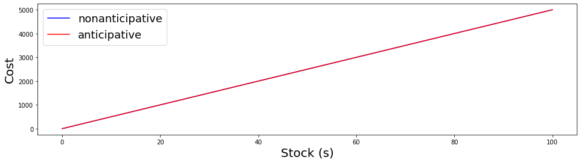
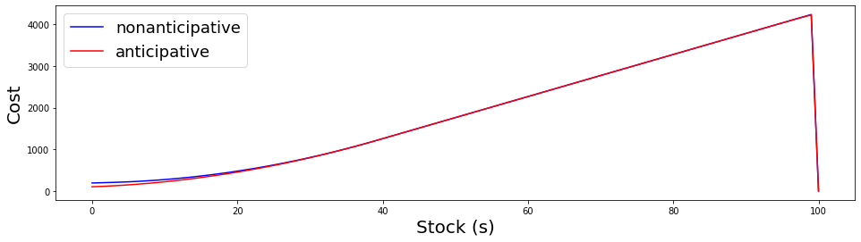
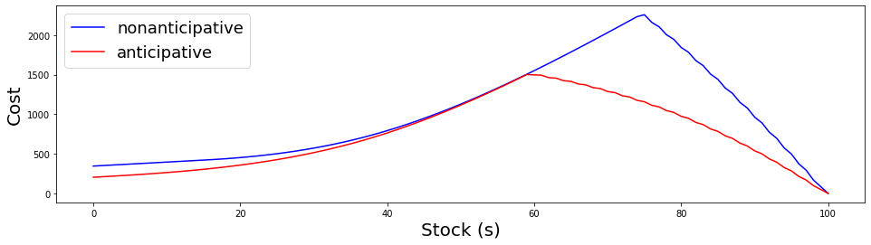
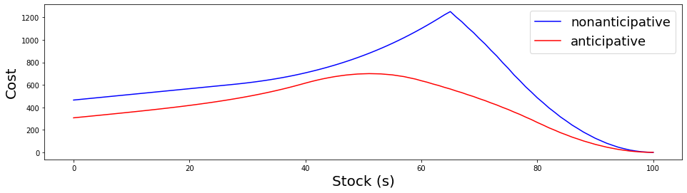
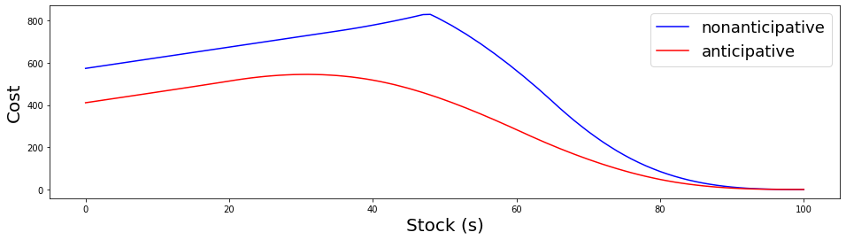
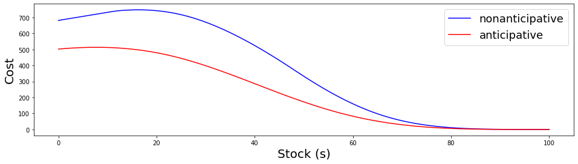

# Bellman value functions

The objective of this notebook is to display examples on Bellman value functions, showing numerically that the anticipative case is a lower bound for the nonanticipative case.

First we import the libraries used.


```python
from random import seed
from random import randint
import matplotlib.pyplot as plt
import numpy as np
import math
```

We define the possible scenarios, states and decision as follows.


```python
# Possible scenarios
Wmax = 40
Wmin = 0

# Possible states
Smax = 100
#Smin = 0

# Possible decisions
Umax = 40
Umin = 0
```

The final cost and the instantaneous cost functions were chosen to be linear, and are given as follows.


```python
# Instantaneous cost function
p = 5
def L(u, s):
    return p*u;
    
# Final cost
Pf = 50
def K1(s):
    if (s >= 80):
        return Pf
    else:
        return 0

def K(s):
    return Pf*s
    
# dynamics
def dynamics(s, u, w):
    return round(min(max(s - u + w, 0), Smax))
```

Here we define the horizon, and the number of scenarios (sampling over the possible values defined above).


```python
# horizon
T = 5

# number of scenarios
Nw = 100
Nw_inv = 1/Nw
```

## Nonanticipative case

First we initialize an array of arrays, to represent the bellman functions that we will fill in in the next steps.


```python
# initialize bellman functions
bellman_function = []
for t in range(T):
    bellman_function.append(np.zeros(Smax + 1))

# final cost
bellman_T = np.zeros(Smax + 1)
for s in range(Smax + 1):
    bellman_T[s] = K(s);

bellman_function.append(bellman_T)
```

Finally, we calculate bellman functions, iterating over all possible timesteps, states, decisions and scenarios.


```python
# Calculate bellman functions    
for t in range(T-1, -1, -1):
    for s in range(Smax):
        min_expected = math.inf # needs to be inf
        for u in range(Umin, Umax):
            expected_value = 0
            for i in range(Nw+1):
                w = Wmin + i * Nw_inv * (Wmax - Wmin)
                expected_value += L(u, s) + bellman_function[t+1][dynamics(s, u, w)]
            expected_value *= Nw_inv
            min_expected = min(expected_value, min_expected)
        bellman_function[t][s] = min_expected
```

## Anticipative case

We repeat the same steps done to the nonanticipative case, as follows.


```python
# initialize anticipating bellman functions
anti_bellman_function = []
for t in range(T):
    anti_bellman_function.append(np.zeros(Smax + 1))

# final cost
bellman_T = np.zeros(Smax + 1)
for s in range(Smax + 1):
    bellman_T[s] = K(s);

anti_bellman_function.append(bellman_T)
```

Here we change the order of the inner loops, in order to calculate the expected value _before_ the minimum.


```python
# Calculate anticipating bellman functions    
for t in range(T-1, -1, -1):
    for s in range(Smax):
        expected_value = 0
        for i in range(Nw+1):
            #w = randint(Wmin, Wmax)
            w = Wmin + i * Nw_inv * (Wmax - Wmin)
            min_value = math.inf
            for u in range(Umin, Umax):
                min_value = min(min_value, L(u, s) + anti_bellman_function[t+1][dynamics(s, u, w)])
            expected_value += min_value
        expected_value *= Nw_inv
        anti_bellman_function[t][s] = expected_value
```

## Plots

We plot the results below.


```python
# plot both results together

for t in range(T, -1, -1):
    x_axis = np.array([i for i in range(Smax + 1)])
    y_axis1 = bellman_function[t]
    y_axis2 = anti_bellman_function[t]
    y_axis3 = bellman_function[t] - anti_bellman_function[t]
    f = plt.figure()
    f.set_figwidth(16)
    #f.set_figheight(8)
    #plt.title("Value functions at time t = "+str(t), fontsize="18")
    plt.plot(x_axis, y_axis1, color="blue", label="nonanticipative")
    plt.plot(x_axis, y_axis2, color="red", label="anticipative")
    plt.xlabel("Stock (s)", fontsize="20")
    plt.ylabel("Cost", fontsize="20")
    #plt.plot(x_axis, y_axis3, "--", color="lightgreen", label="diff")
    plt.legend(fontsize="18")
    plt.savefig("value_functions_up_T-" + str(T-t)+ ".png")
    plt.show()
    
```


    

    


    

    


    

    


    

    


    

    


    

    

